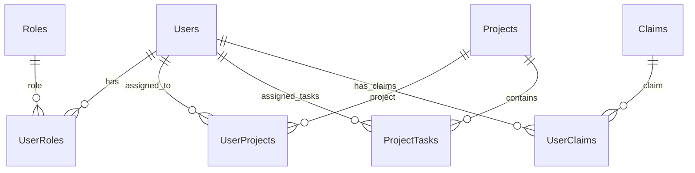

# GenAI Smart Flow PM System

A comprehensive project management system built with Clean Architecture, featuring .NET 9 backend and Next.js 15 + React 19 + TypeScript + Tailwind CSS frontend with .NET Aspire orchestration.

## 📅 Recent Updates (August 13, 2025)

### ✅ Toast Notification System v2.0 - Modern Redesign

- **Sleek Modern Design**: Clean white background with colored left borders following current UI trends
- **Single-Line Messages**: Combined title and message for cleaner, more compact presentation
- **Enhanced Icons**: Bold icons with stroke-2 for better visibility and professional appearance
- **Reduced Height**: Optimized padding for less screen occupation while maintaining readability
- **Smart Queue Management**: Maximum 3 toasts with intelligent duplicate prevention and overflow control
- **Professional Positioning**: Top-right placement with slide-in animations for modern feel
- **Queue Intelligence**:
  - Prevents similar toasts from stacking
  - Removes oldest non-persistent toasts first
  - Maintains persistent error toasts while managing queue size
- **Performance Optimized**: Faster 200ms animations with hardware-accelerated transforms
- **API Integration**: useApiWithToast hook for automatic error handling across all operations
- **Accessibility**: ARIA labels, live regions, and keyboard navigation support
- **Developer Experience**: Simple hook-based usage with TypeScript support
- **Demo Page**: Enhanced demonstration at `/toast-demo` with "Test Multiple Errors" feature

### ✅ Dashboard UI Improvements & Analytics

- **Reduced App Bar Height**: Streamlined TopBar from `py-4` to `py-2` for more compact appearance
- **Removed Welcome Header**: Eliminated "Welcome back" section for cleaner dashboard layout
- **Professional Analytics Dashboard**: Added comprehensive project management analytics with enterprise-grade charts
- **Task Status Distribution**: Interactive pie chart showing Open, In Progress, Completed, and Blocked tasks
- **Task Type Analytics**: Bar chart breakdown of Task, Bug, Spike, Story, and Epic types
- **Project Status Overview**: Multi-project comparison with stacked bar charts
- **Sprint Burndown Chart**: Agile-standard burndown showing Planned vs Actual progress with area visualization
- **Recharts Integration**: Professional data visualization library for interactive charts
- **Reorganized Layout**: Stats grid (top), analytics section (middle), information cards (bottom)
- **Enhanced Information Cards**: Redesigned Announcement, Holidays, and Recent Activity cards with clean white backgrounds
- **Responsive Design**: All charts and layouts adapt seamlessly to different screen sizes
- **Modern Color Scheme**: Consistent professional color palette across all visualizations

### ✅ Frontend Implementation Complete

- **Next.js 15.4.6**: Upgraded from 14.x with full React 19 support
- **Custom Login Design**: Implemented responsive login form matching provided mockup
- **Dashboard Interface**: Complete dashboard with animated stats and activity feed
- **Responsive Layout**: Collapsible sidebar with context-based state management
- **Authentication**: JWT token management with useAuth hook
- **CSS Animations**: Custom Tailwind animations for React 19 compatibility
- **Build System**: Production-ready with optimized static generation
- **Port Configuration**: Fixed ports for consistent development (UI: 3001, API: 5052)

### ✅ Backend API Enhancements

- **Authentication Endpoint**: Added missing `/auth/me` endpoint for getCurrentUser functionality
- **API Completeness**: All core authentication endpoints now available
- **CORS Configuration**: Proper cross-origin request handling for frontend integration

### ✅ Code Quality & Maintenance

- **File Cleanup**: Removed unused dashboard component files (Dashboard.tsx, Dashboard_new.tsx)
- **Clean Architecture**: Maintained proper separation with Next.js App Router structure
- **Export Management**: Updated component index files to reflect current structure
- **Error Prevention**: Comprehensive compilation checks after cleanup operations

### 🔧 Technical Enhancements

- **TypeScript 5.9.2**: Full type safety with backend DTO integration
- **Tailwind CSS**: Custom purple theme (#7c3aed) with responsive design
- **VS Code Integration**: Complete workspace configuration with debugging support
- **Aspire Orchestration**: Enhanced AppHost with process cleanup and config generation

## 🏗️ Architecture Overview

This project implements **Clean Architecture** principles with a clear separation of concerns across multiple layers:

```text
📁 GenAI.SmartFlowPM/
├── 🔧 SmartFlowPM.AppHost/                        # .NET Aspire Orchestration
├── 📂 src/
│   ├── 🏛️ Core/
│   │   ├── GenAI.SmartFlowPM.Domain/              # Domain Entities & Interfaces
│   │   └── GenAI.SmartFlowPM.Application/         # Business Logic & CQRS
│   ├── 🔗 Infrastructure/
│   │   ├── GenAI.SmartFlowPM.Infrastructure/      # External Services
│   │   └── GenAI.SmartFlowPM.Persistence/         # Data Access & EF Core
│   └── 🌐 Web/
│       ├── GenAI.SmartFlowPM.WebAPI/              # ASP.NET Core Web API
│       └── 📱 GenAI.SmartFlowPM.UI/               # ✅ Next.js 15 + React 19 + TypeScript + Tailwind CSS
```

## ✨ Features Implemented

### 🎯 Core Features

- ✅ **User Management** - Registration, Authentication, Role-based Authorization with Organizational Hierarchy
  - **User CRUD Operations** - Complete user lifecycle management with multi-tenant support
  - **HasReportee Property** - Manager identification for organizational hierarchy tracking
  - **JWT Authentication** - Secure token-based authentication with role-based authorization
  - **User DTOs** - Comprehensive data transfer objects (UserDto, CreateUserDto, UpdateUserDto, UserSummaryDto)
  - **API Integration** - Full REST API with all endpoints including HasReportee information
  - **Backend Complete** - 100% implemented with CQRS pattern and tenant isolation
  - **Frontend Complete** - ✅ Implemented with Next.js 15 + React 19 + custom login design
- ✅ **Multi-Tenant Architecture** - Complete SaaS multi-tenancy support
  - **Tenant Isolation** - Shared database with row-level security via TenantId
  - **Data Segregation** - All entities inherit from TenantBaseEntity for complete data isolation
  - **Tenant Management** - Full CRUD operations for tenant lifecycle management
  - **Subscription Management** - Tenant subscription plans with user/project limits
  - **Subdomain Support** - Tenant identification via subdomain routing
  - **Security** - Complete data isolation between tenants with foreign key constraints
  - **Performance** - Optimized with tenant-scoped indexes and efficient queries
  - **Backend Implementation** - Complete CQRS implementation with validation
  - **API Endpoints** - Full REST API for tenant management operations
  - **Database Migration** - Applied with tenant table and multi-tenant columns
  - **Frontend Complete** - ✅ Implemented with responsive design and tenant-aware routing
- ✅ **Organization Management** - Complete organizational structure management (Admin only)
  - **Organization CRUD** - Create, view, edit, and delete organizations with comprehensive details
  - **Branch Management** - Multi-location branch management with manager assignments
  - **Company Policies** - Policy management system for organizational governance
  - **Company Holidays** - Holiday calendar management for organization-wide planning
  - **Organization Settings** - Configurable organization-wide system settings
  - **Backend Implementation** - Full EF Core implementation with proper relationships and indexing
  - **API Endpoints** - Complete REST API for organization management
  - **Frontend** - 🚧 To be implemented with Next.js + TypeScript + Tailwind CSS
- ✅ **Project Management** - Complete CRUD operations with backend APIs
  - **Backend Implementation** - CQRS pattern with comprehensive validation
  - **API Endpoints** - Full REST API for project management
  - **Frontend** - 🚧 To be implemented with Next.js + TypeScript + Tailwind CSS
- ✅ **Task Management** - Comprehensive task tracking with assignments and status updates
  - **Backend Implementation** - Complete CQRS pattern with auto-generated task numbers
  - **API Endpoints** - Full REST API for task management
  - **Frontend** - 🚧 To be implemented with Next.js + TypeScript + Tailwind CSS
  - Task List with modern table view, modal integration, and inline status editing
  - Task assignment to team members with priority indicators and status workflow
  - Status progression through To Do, In Progress, In Review, Done, Blocked
  - **Auto-Generated Task Numbers** - Unique task identifiers with acronym-based numbering (e.g., DEV-000001, TEST-000002)
  - **User Assignment Display** - Professional user icons and assignment indicators in task lists
  - **Acronym-Based Categorization** - Tasks categorized by type (DEV, TEST, DOC, BUG, FEAT)
  - **Dashboard Statistics API** - Optimized endpoint for user-specific task metrics (total, completed, pending tasks)
- ✅ **Dashboard Analytics** - Real-time statistics and project overview
  - **Backend API** - Optimized dashboard endpoints for statistics
  - **Frontend** - 🚧 To be implemented with Next.js + TypeScript + Tailwind CSS
  - **Performance Optimized** - Server-side calculation of task statistics
  - **User-Specific Metrics** - Personalized task counts and pending task lists
  - **Real-time Updates** - Live dashboard data with efficient API calls
- ✅ **Role-Based Security** - Admin, ProjectManager, TeamLead, Developer, Tester, Viewer roles
- ✅ **Claims Management** - Complete fine-grained permission system with CRUD operations
  - **API-First Implementation** - Full REST API with admin-only authorization for management operations
  - **Backend Implementation** - Complete CQRS architecture with validation and error handling
  - **Permission Types** - Support for different claim types (Permission, Role, Feature)
  - **Status Management** - Active/Inactive claims management
  - **Default Claims Seeded** - Comprehensive set of default permissions for all modules
  - **Frontend** - 🚧 To be implemented with Next.js + TypeScript + Tailwind CSS

### 🔧 Technical Implementation

#### **Backend (.NET 9)**

- ✅ **Clean Architecture** - Domain, Application, Infrastructure, Presentation layers
- ✅ **CQRS Pattern** - Command Query Responsibility Segregation with MediatR
  - Project Commands: CreateProjectCommand, UpdateProjectCommand, DeleteProjectCommand
  - Task Commands: CreateTaskCommand, UpdateTaskCommand, DeleteTaskCommand, AssignTaskCommand
  - **Task Dashboard Queries**: GetUserTaskDashboardQuery for optimized dashboard statistics
  - Complete command handlers with validation and error handling
- ✅ **Repository Pattern** - Generic repository with specific implementations
- ✅ **JWT Authentication** - Secure token-based authentication
- ✅ **Entity Framework Core** - PostgreSQL database with migrations
- ✅ **AutoMapper** - Entity to DTO mapping
- ✅ **FluentValidation** - Request validation
- ✅ **Swagger/OpenAPI** - API documentation
- ✅ **Comprehensive Data Seeding** - Realistic test data with Bogus library

#### **Frontend (Next.js 15 + React 19 + TypeScript + Tailwind CSS)** ✅

- ✅ **Next.js 15.4.6** - Latest version with React 19.1.1 and App Router
- ✅ **TypeScript 5.9.2** - Full type safety with backend DTO integration
- ✅ **Tailwind CSS** - Custom purple theme (#7c3aed) with responsive design
- ✅ **Authentication System** - JWT token management with protected routes
- ✅ **Layout System** - Responsive sidebar with context-based state management
- ✅ **Dashboard Interface** - Animated stats cards and real-time activity feed
- ✅ **Toast Notification System v2.0** - Modern, sleek notification system with smart queue management
  - **Modern Design**: Clean white background with colored left borders, single-line messages
  - **Bold Icons**: Enhanced visibility with stroke-2 styling for professional appearance
  - **Smart Queue**: Maximum 3 toasts with duplicate prevention and intelligent overflow control
  - **Four Toast Types**: Success (emerald), Error (red), Warning (amber), Info (blue)
  - **Advanced Features**: Auto-dismiss, persistent notifications, slide-in animations
  - **Queue Intelligence**: Prevents screen flooding, removes oldest non-persistent toasts first
  - **Developer Experience**: useApiWithToast hook for automatic API error handling
  - **Accessibility**: ARIA labels, live regions, and keyboard navigation support
  - **Demo Enhancement**: Interactive demonstration at `/toast-demo` with multiple error testing
- ✅ **CSS Animations** - Custom animations optimized for React 19 compatibility
- ✅ **Build System** - Production-ready with static generation and optimized bundles
- ✅ **VS Code Integration** - Complete workspace configuration with debugging support

#### **DevOps & Orchestration**

- ✅ **.NET Aspire** - Complete application orchestration
- ✅ **PostgreSQL** - Database containerization
- ✅ **Service Discovery** - Automatic service configuration
- ✅ **Environment Management** - Development/Production configurations

## 🗄️ Database Schema

### Core Entities

- **Users** - User accounts with hierarchical management and organizational structure
  - **HasReportee** - Boolean field indicating if user has subordinates (manager status)
  - **TenantId** - Multi-tenant isolation with foreign key to Tenants table
  - **ManagerId** - Self-referencing foreign key for organizational hierarchy
  - **Standard Fields** - FirstName, LastName, Email, UserName, PasswordHash, PhoneNumber, IsActive, LastLoginAt
  - **Audit Fields** - CreatedAt, UpdatedAt, CreatedBy, UpdatedBy, IsDeleted
- **Roles** - System roles (Admin, ProjectManager, etc.)
- **Claims** - Granular permissions system with type categorization (Permission, Role, Feature)
  - **Name** - Unique claim identifier (e.g., users.create, projects.read)
  - **Type** - Claim categorization for UI display and organization
  - **Description** - Human-readable description of the claim's purpose
  - **IsActive** - Status flag for enabling/disabling claims
- **Projects** - Project entities with status, priority, budget tracking
- **ProjectTasks** - Task management with assignments, time tracking, and auto-generated task numbers
  - **Acronym** - Task type identifier (DEV, TEST, DOC, BUG, FEAT)
  - **TaskNumber** - Auto-generated unique identifier (e.g., DEV-000001)
- **Counters** - Auto-incrementing counter system for task number generation
- **UserProjects** - Many-to-many relationship with project roles
- **UserRoles** - User role assignments
- **UserClaims** - User-specific permissions

### Relationships



## � API Endpoints

### **Task Management API**

- `GET /api/tasks` - Get paginated list of tasks
- `GET /api/tasks/{id}` - Get task by ID
- `POST /api/tasks` - Create new task
- `PUT /api/tasks/{id}` - Update task
- `DELETE /api/tasks/{id}` - Delete task
- `PUT /api/tasks/{id}/assign` - Assign task to user
- `GET /api/tasks/project/{projectId}` - Get tasks by project
- `GET /api/tasks/user/{userId}` - Get tasks by assigned user
- **`GET /api/tasks/dashboard/user/{userId}`** - **Get user task dashboard statistics**

### **Claims Management API**

- `GET /api/claims` - Get paginated list of claims
- `GET /api/claims/{id}` - Get claim by ID
- `GET /api/claims/by-name/{name}` - Get claim by name
- `GET /api/claims/active` - Get all active claims
- `POST /api/claims` - Create new claim (Admin only)
- `PUT /api/claims/{id}` - Update claim (Admin only)
- `DELETE /api/claims/{id}` - Delete claim (Admin only)

### **Dashboard API Features**

- **User Task Dashboard**: Optimized endpoint for dashboard statistics
- **Response Data**:
  - Total task count assigned to user
  - Completed task count (Status = Done)
  - Pending task count (all non-completed tasks)
  - List of pending tasks ordered by due date and priority
- **Performance**: Server-side calculation reduces client-side processing
- **Accuracy**: Consistent business logic for task metrics

## �🚀 Getting Started

## 📋 Project, Task & Claims Module Implementation

### **Project Management Module**

#### **Backend Implementation**

The Project module follows CQRS pattern with complete command and query separation:

**Commands (`src/Core/GenAI.SmartFlowPM.Application/Features/Projects/Commands/`)**

- `CreateProjectCommand.cs` - Creates new projects with validation
- `UpdateProjectCommand.cs` - Updates existing projects with partial updates
- `DeleteProjectCommand.cs` - Handles project deletion with dependency checks

**Command Handlers (`src/Core/GenAI.SmartFlowPM.Application/Features/Projects/Handlers/`)**

- `ProjectCommandHandlers.cs` - Implements all project commands with:
  - Async/await pattern for optimal performance
  - AutoMapper integration for entity-DTO mapping
  - Comprehensive error handling and validation
  - Unit of Work pattern for transactional operations

**Frontend**: 🚧 To be implemented with Next.js + TypeScript + Tailwind CSS

### **Task Management Module**

#### **Task Backend Implementation**

Comprehensive task management with CQRS architecture:

**Commands (`src/Core/GenAI.SmartFlowPM.Application/Features/Tasks/Commands/`)**

- `CreateTaskCommand.cs` - Creates tasks with project validation and auto-generated task numbers
- `UpdateTaskCommand.cs` - Updates task properties including status
- `DeleteTaskCommand.cs` - Handles task deletion with dependency checks
- `AssignTaskCommand.cs` - Assigns tasks to users with validation

**Command Handlers (`src/Core/GenAI.SmartFlowPM.Application/Features/Tasks/Handlers/`)**

- `TaskCommandHandlers.cs` - Implements all task operations with:
  - User assignment validation and conflict resolution
  - Status workflow enforcement (To Do → In Progress → In Review → Done)
  - Project membership validation for task assignments
  - **Auto-Generated Task Numbers** - Integration with CounterService for unique task identifiers
  - Optimistic concurrency handling for simultaneous updates

**Services (`src/Infrastructure/GenAI.SmartFlowPM.Persistence/Services/`)**

- `CounterService.cs` - Thread-safe auto-incrementing counter system:
  - Generates unique task numbers with format: ACRONYM-000001 (minimum 6 digits)
  - Thread-safe counter management with database persistence
  - Support for multiple counter types (Task_DEV, Task_TEST, etc.)
  - Reset functionality for counter management

**Frontend**: 🚧 To be implemented with Next.js + TypeScript + Tailwind CSS

### **Claims Management Module**

#### **Claims Backend Implementation**

The Claims module follows API-first approach with complete CQRS implementation:

**Commands (`src/Core/GenAI.SmartFlowPM.Application/Features/Claims/Commands/`)**

- `CreateClaimCommand.cs` - Creates new claims with name uniqueness validation
- `UpdateClaimCommand.cs` - Updates existing claims with conflict checking
- `DeleteClaimCommand.cs` - Handles claim deletion with usage validation

**Queries (`src/Core/GenAI.SmartFlowPM.Application/Features/Claims/Queries/`)**

- `GetAllClaimsQuery.cs` - Paginated claims retrieval with search support
- `GetClaimByIdQuery.cs` - Individual claim lookup by ID
- `GetClaimByNameQuery.cs` - Claim lookup by unique name
- `GetActiveClaimsQuery.cs` - Retrieves only active claims for selection lists

**Command Handlers (`src/Core/GenAI.SmartFlowPM.Application/Features/Claims/Handlers/`)**

- `ClaimCommandHandlers.cs` - Implements all claim commands with comprehensive validation
- `ClaimQueryHandlers.cs` - Implements all claim queries with optimized database access

**Repository Implementation (`src/Infrastructure/GenAI.SmartFlowPM.Persistence/Repositories/`)**

- Enhanced `ClaimRepository` with methods: `GetByNameAsync`, `ExistsByNameAsync`, `GetActiveClaimsAsync`
- Supports name uniqueness validation and active claim filtering

**Frontend**: 🚧 To be implemented with Next.js + TypeScript + Tailwind CSS

- Status management through backend APIs and DTOs
- Type categorization handled at the data layer
- 🚧 UI styling and effects to be implemented with Tailwind CSS

#### **API Authorization**

- **Read Operations**: Available to all authenticated users
- **Management Operations**: Create, Update, Delete restricted to Admin role only
- **Secure Endpoints**: Proper authorization attributes on all management endpoints

#### **Data Seeding**

Comprehensive default claims automatically seeded:

- **User Permissions**: users.create, users.read, users.update, users.delete
- **Project Permissions**: projects.create, projects.read, projects.update, projects.delete
- **Task Permissions**: tasks.create, tasks.read, tasks.update, tasks.delete
- **Organization Permissions**: organizations.create, organizations.read, organizations.update, organizations.delete
- **Branch Permissions**: branches.create, branches.read, branches.update, branches.delete
- **System Permissions**: reports.view, admin.access

### **Integration Features**

#### **Dashboard Quick Actions**

- **Backend API Support**: API endpoints for quick project and task creation
- **Frontend**: 🚧 To be implemented with Next.js + TypeScript + Tailwind CSS

#### **Cross-Module Communication**

- **Project-Task Relationship**: Tasks are properly linked to projects with foreign key constraints
- **User Assignment**: Both projects and tasks support user assignment with role-based permissions
- **Status Synchronization**: Project status updates based on task completion percentages
- **API Integration**: RESTful APIs for seamless module interaction

#### **Data Consistency**

- **Transactional Operations**: All operations use Unit of Work pattern for data consistency
- **Optimistic Concurrency**: Handles simultaneous updates to prevent data conflicts
- **Validation Layer**: Comprehensive validation at both API and UI levels
- **Error Handling**: Graceful error handling with user-friendly messages

#### **Performance Optimizations**

- **Lazy Loading**: Components and data loaded on demand
- **Caching**: API responses cached for frequently accessed data
- **Pagination**: Large datasets handled with server-side pagination
- **Debounced Search**: Search inputs debounced to reduce API calls

### **Architecture Features**

- **Backend Implementation**: Complete API implementation with .NET 9
- **Database Design**: PostgreSQL with Entity Framework Core
- **Business Logic**: Clean Architecture with CQRS pattern
- **Frontend**: 🚧 To be implemented with Next.js + TypeScript + Tailwind CSS

## 🚀 Getting Started

### Prerequisites

- **.NET 9 SDK**
- **Node.js 18+**
- **PostgreSQL** (or Docker for containerized DB)
- **Visual Studio 2022** or **VS Code**

### 🔧 Installation & Setup

#### **Option 1: .NET Aspire (Recommended)**

```bash
# Clone the repository
git clone <repository-url>
cd GenAI.SmartFlowPM

# Start the complete application stack
cd SmartFlowPM.AppHost
dotnet run
```

This will automatically:

- Start PostgreSQL database container
- Run database migrations  
- Launch the .NET API backend
- Start the Next.js frontend
- Open the Aspire Dashboard at <https://localhost:17057>

#### **Option 2: Manual Setup**

1. **Clone the Repository**

   ```bash
   git clone <repository-url>
   cd GenAI.SmartFlowPM
   ```

2. **Install .NET Dependencies**

   ```bash
   dotnet restore
   ```

3. **Install Frontend Dependencies**

   ```bash
   cd src/Web/GenAI.SmartFlowPM.UI
   npm install
   cd ../../..
   ```

4. **Start Services Manually**

   ```bash
   # Terminal 1: Start PostgreSQL
   docker run --name smartflowpm-postgres -e POSTGRES_PASSWORD=yourpassword -p 5432:5432 -d postgres
   
   # Terminal 2: Start API  
   cd src/Web/GenAI.SmartFlowPM.WebAPI
   dotnet run
   
   # Terminal 3: Start Frontend
   cd src/Web/GenAI.SmartFlowPM.UI
   npm run dev
   ```

### 🔗 Application URLs

- **Aspire Dashboard**: <https://localhost:17057> (with .NET Aspire)
- **API Swagger**: <https://localhost:5052/swagger> (fixed port)
- **Frontend UI**: <http://localhost:3001> (Next.js development server)
- **PostgreSQL**: localhost:5432

## 🛠️ Technology Stack

### **Backend (✅ Completed)**

- **.NET 9**: Latest .NET framework with C# 13
- **ASP.NET Core Web API**: RESTful API with OpenAPI/Swagger
- **Entity Framework Core**: Database ORM with PostgreSQL
- **Clean Architecture**: Domain-driven design with CQRS pattern
- **FluentValidation**: Request validation
- **AutoMapper**: Object-to-object mapping
- **Serilog**: Structured logging
- **MediatR**: Command/Query pattern implementation

### **Frontend (✅ Completed)**

- **Next.js 15.4.6**: Latest React framework with App Router
- **React 19.1.1**: Latest React with improved performance
- **TypeScript 5.9.2**: Full type safety across the application
- **Tailwind CSS**: Utility-first CSS framework with custom purple theme
- **CSS Animations**: Custom animations for React 19 compatibility
- **Responsive Design**: Mobile-first approach with collapsible sidebar
- **JWT Authentication**: Token-based authentication with useAuth hook

### **Database & Infrastructure**

- **PostgreSQL**: Primary database with multi-tenant support
- **Docker**: Containerization support
- **.NET Aspire**: Orchestration and service discovery
- **Azure**: Cloud deployment ready

### 🔐 Default Credentials

| Role | Username | Password | Email |
|------|----------|----------|-------|
| Admin | admin | Admin123! | <admin@projectmanagement.com> |
| Project Manager | jmanager | Manager123! | <john.manager@projectmanagement.com> |
| Developer | jdeveloper | Developer123! | <jane.developer@projectmanagement.com> |
| Tester | btester | Tester123! | <bob.tester@projectmanagement.com> |

## 📊 Seeded Data

The application comes with realistic test data:

- **6 System Roles** with hierarchical permissions
- **14 Granular Claims** for fine-grained authorization
- **4 Test Users** representing different organizational roles
- **5 Realistic Projects** with varied statuses and priorities
- **40 Project Tasks** distributed across projects
- **15 User-Project Assignments** with appropriate roles

## 🛠️ Development

### Project Structure

#### **Domain Layer** (`src/Core/GenAI.SmartFlowPM.Domain/`)

```text
├── Common/
│   └── BaseEntity.cs                 # Base entity with audit fields
├── Entities/
│   ├── User.cs                       # User entity
│   ├── Role.cs                       # Role entity
│   ├── Project.cs                    # Project entity
│   ├── ProjectTask.cs                # Task entity
│   └── ...                          # Other entities
├── Enums/
│   ├── ProjectStatus.cs              # Project status enumeration
│   ├── TaskStatus.cs                 # Task status enumeration
│   └── ...                          # Other enums
└── Interfaces/
    ├── IProjectRepository.cs         # Project repository contract
    └── ...                          # Other interfaces
```

#### **Application Layer** (`src/Core/GenAI.SmartFlowPM.Application/`)

```text
├── Features/
│   ├── Projects/
│   │   ├── Commands/                 # Project CQRS commands
│   │   │   ├── CreateProjectCommand.cs      # Create new project command
│   │   │   ├── UpdateProjectCommand.cs      # Update existing project command  
│   │   │   └── DeleteProjectCommand.cs      # Delete project command
│   │   ├── Queries/                  # Project queries (Get, List, Search)
│   │   └── Handlers/                 # CQRS command and query handlers
│   │       ├── ProjectCommandHandlers.cs    # Complete command handling implementation
│   │       └── ProjectQueryHandlers.cs      # Query handling implementation
│   └── Tasks/
│       ├── Commands/                 # Task CQRS commands
│       │   ├── CreateTaskCommand.cs         # Create new task command
│       │   ├── UpdateTaskCommand.cs         # Update existing task command
│       │   ├── DeleteTaskCommand.cs         # Delete task command
│       │   └── AssignTaskCommand.cs         # Assign task to user command
│       ├── Queries/                  # Task queries
│       └── Handlers/                 # CQRS handlers
│           ├── TaskCommandHandlers.cs       # Complete task command handling
│           └── TaskQueryHandlers.cs         # Task query handling
├── DTOs/                             # Data Transfer Objects
├── Mappings/                         # AutoMapper profiles
└── Extensions/
    └── ServiceCollectionExtensions.cs
```

#### **Infrastructure Layer** (`src/Infrastructure/`)

```text
├── GenAI.SmartFlowPM.Infrastructure/
│   ├── Services/                     # External service implementations
│   └── Extensions/
└── GenAI.SmartFlowPM.Persistence/
    ├── Context/
    │   └── ApplicationDbContext.cs   # EF Core context
    ├── Repositories/                 # Repository implementations
    ├── Configurations/               # Entity configurations
    ├── Migrations/                   # EF Core migrations
    └── Seeders/
        └── DataSeeder.cs             # Comprehensive data seeding
```

#### **Presentation Layer** (`src/Web/GenAI.SmartFlowPM.WebAPI/`)

```text
├── Controllers/
│   ├── AuthController.cs            # Authentication endpoints
│   ├── ProjectsController.cs        # Project management endpoints
│   ├── TasksController.cs           # Task management endpoints
│   └── UsersController.cs           # User management endpoints
└── Program.cs                       # Application startup & configuration
```

#### **Frontend Layer** (`project-management-ui/src/app/`)

```text
├── auth/
│   └── login/                       # Authentication components
├── core/
│   ├── guards/                      # Route guards for authentication
│   ├── models/                      # TypeScript interfaces and enums
│   └── services/                    # API services and business logic
├── shared/
│   ├── components/                  # 🚧 To be implemented: Shared Next.js components
│   │   ├── Layout.tsx               # 🚧 Main layout component with sidebar
│   │   ├── Navbar.tsx               # 🚧 Top navigation bar
│   │   └── Modal.tsx                # 🚧 Reusable modal component
│   └── hooks/                       # 🚧 Custom React hooks (to be implemented)
├── pages/
│   ├── Dashboard.tsx                # 🚧 Enhanced dashboard with widgets (to be implemented)
│   └── NotFound.tsx                 # 🚧 404 error page (to be implemented)
├── components/
│   ├── projects/
│   │   ├── ProjectList.tsx          # 🚧 Project listing with cards and filtering (to be implemented)
│   │   ├── ProjectDetail.tsx        # 🚧 Comprehensive project detail view with tabs (to be implemented)
│   │   ├── ProjectForm.tsx          # 🚧 Project form component for create/edit (to be implemented)
│   │   └── ProjectCard.tsx          # 🚧 Individual project card component (to be implemented)
│   ├── tasks/
│   │   ├── TaskList.tsx             # 🚧 Advanced task management with table view (to be implemented)
│   │   ├── TaskForm.tsx             # 🚧 Task form component for create/edit (to be implemented)
│   │   └── TaskBoard.tsx            # 🚧 Kanban-style task board (to be implemented)
│   └── claims/
│       ├── ClaimList.tsx            # 🚧 Claims management table (to be implemented)
│       └── ClaimForm.tsx            # 🚧 Claims form component (to be implemented)
├── services/
│   ├── apiService.ts                # 🚧 Base API service with authentication (to be implemented)
│   ├── projectService.ts            # 🚧 Project-specific API calls (to be implemented)
│   ├── taskService.ts               # 🚧 Task-specific API calls (to be implemented)
│   └── claimService.ts              # 🚧 Claims-specific API calls (to be implemented)
├── context/
│   ├── AuthContext.tsx              # 🚧 Authentication context provider (to be implemented)
│   └── ThemeContext.tsx             # 🚧 Theme management context (to be implemented)
└── utils/
    ├── constants.ts                 # 🚧 Application constants (to be implemented)
    └── helpers.ts                   # 🚧 Utility functions (to be implemented)
```

#### **Frontend Architecture (🚧 To be implemented)**

```text
📱 Next.js Application Structure (Planned)
├── 🔧 Layout Components (To be built)
│   ├── Header with navigation and breadcrumbs
│   ├── Sidebar with menu structure
│   ├── Main content area
│   └── Footer
├── 📊 Page Components (To be built)
│   ├── Action Buttons (Add, Search, Notifications)
│   └── User Profile Menu
└── 📄 Main Content Area
    ├── Dashboard Widgets
    ├── Project Management
    ├── Task Management
    └── Router Outlet for Page Content
```

### Key Design Patterns

#### **Backend Patterns**

1. **CQRS (Command Query Responsibility Segregation)**
   - Separate models for read and write operations
   - MediatR for command/query handling

2. **Repository Pattern**
   - Generic repository with specific implementations
   - Unit of Work pattern through DbContext

3. **Clean Architecture**
   - Dependency inversion principle
   - Domain-centric design

4. **Factory Pattern**
   - Service factory for dependency injection

#### **Frontend Patterns**

1. **Layout Container Pattern**
   - Single layout component managing overall shell
   - Sidebar navigation with main content area
   - Header with dynamic breadcrumbs and user actions

2. **Data Service Pattern**
   - Modular data services for different entity types
   - API endpoints with proper data transfer objects
   - Backend data validation and business logic

3. **Service Layer Pattern**
   - Microservices architecture pattern
   - API communication with HTTP clients
   - Authentication and authorization

4. **Service Layer Pattern**
   - Clean service interfaces
   - Dependency injection implementation
   - 🚧 Frontend integration to be implemented with Next.js

5. **Badge System Pattern**
   - Backend status management with enums
   - Data transfer objects for status representation
   - 🚧 Frontend styling to be implemented with Tailwind CSS

## 📡 API Endpoints

### Authentication

```http
POST /api/auth/login           # User login
POST /api/auth/register        # User registration
POST /api/auth/refresh         # Token refresh
```

### Projects

```http
GET    /api/projects                    # Get paginated projects with filtering
GET    /api/projects/{id}               # Get project by ID with full details
POST   /api/projects                    # Create new project with validation
PUT    /api/projects/{id}               # Update project with partial updates
DELETE /api/projects/{id}               # Soft delete project with dependencies
GET    /api/projects/user/{userId}      # Get user's assigned projects
POST   /api/projects/{id}/assign        # Assign user to project with role
```

### Tasks

```http
GET    /api/tasks                       # Get paginated tasks with filtering
GET    /api/tasks/{id}                  # Get task by ID with assignee details
POST   /api/tasks                       # Create new task with project validation
PUT    /api/tasks/{id}                  # Update task including status changes
DELETE /api/tasks/{id}                  # Delete task with dependency checks
GET    /api/tasks/project/{projectId}   # Get all tasks for specific project
GET    /api/tasks/user/{userId}         # Get user's assigned tasks
PUT    /api/tasks/{id}/assign           # Assign task to user with validation
PUT    /api/tasks/{id}/status           # Update task status with workflow validation
```

### Users

```http
GET    /api/users                       # Get paginated users with HasReportee info
GET    /api/users/{id}                  # Get user by ID including HasReportee status
POST   /api/users                       # Create new user with HasReportee assignment
PUT    /api/users/{id}                  # Update user including HasReportee property
DELETE /api/users/{id}                  # Delete user with data integrity
```

## 🔐 Security Implementation

### JWT Authentication

- Secure token-based authentication
- Configurable token expiration
- Refresh token support
- Claims-based authorization

### Authorization

- Role-based access control (RBAC)
- Granular permission system
- API endpoint protection

### Data Protection

- Password hashing with secure algorithms
- SQL injection prevention through parameterized queries
- CORS configuration for cross-origin requests
- Input validation and sanitization

## 🧪 Testing Strategy

### Backend Testing

- Unit tests for domain logic
- Integration tests for repositories
- API endpoint testing
- Authentication flow testing

### Frontend Testing

- Component unit tests
- Service testing
- E2E testing with Cypress
- Authentication guard testing

## 📈 Performance Optimizations

- **Database Indexing** on frequently queried columns
- **Pagination** for large data sets
- **Caching** for static data
- **Optimized Queries** with EF Core

## 🔄 Continuous Integration

- **GitHub Actions** workflows
- **Automated testing** on pull requests
- **Code quality** checks
- **Security scanning**

## 🚀 Deployment

### Production Deployment

1. **Database Migration**

   ```bash
   dotnet ef database update --project src/Infrastructure/GenAI.SmartFlowPM.Persistence
   ```

2. **Build Frontend (When Ready)**

   ```bash
   # Will be implemented later
   cd GenAI.SmartFlowPM.UI
   npm run build
   ```

3. **Deploy API**

   ```bash
   dotnet publish --configuration Release
   ```

### Docker Deployment

```dockerfile
# API Dockerfile
FROM mcr.microsoft.com/dotnet/aspnet:9.0 AS base
WORKDIR /app
EXPOSE 80

FROM mcr.microsoft.com/dotnet/sdk:9.0 AS build
WORKDIR /src
COPY . .
RUN dotnet restore
RUN dotnet publish -c Release -o /app

FROM base AS final
WORKDIR /app
COPY --from=build /app .
ENTRYPOINT ["dotnet", "GenAI.SmartFlowPM.WebAPI.dll"]
```

## 🛠️ Technology Stack Overview

### Backend Technologies

| Technology | Version | Purpose |
|------------|---------|---------|
| .NET | 9.0 | Core framework |
| ASP.NET Core | 9.0 | Web API framework |
| Entity Framework Core | 9.0 | ORM |
| PostgreSQL | 16+ | Database |
| MediatR | 12.0 | CQRS implementation |
| AutoMapper | 12.0 | Object mapping |
| FluentValidation | 11.0 | Validation |
| Swagger/OpenAPI | 3.0 | API documentation |
| JWT Bearer | 8.0 | Authentication |

### DevOps

| Technology | Version | Purpose |
|------------|---------|---------|
| .NET Aspire | 9.4 | Application orchestration |
| Docker | Latest | Containerization |
| GitHub Actions | Latest | CI/CD |

### 🛠️ Backend Implementation Highlights

#### **Enhanced Project Management API**

- **Feature**: Comprehensive project management backend services
- **Implementation**:
  - RESTful API endpoints with proper HTTP status codes
  - Entity Framework Core with PostgreSQL integration
  - CQRS pattern with command and query handlers
- **Data Layer**:
  - Robust entity relationships and constraints
  - Database migrations and seeding
  - Optimized queries with proper indexing
- **Validation**: Server-side validation with FluentValidation

#### **Search and Filtering Backend**

- **Feature**: Advanced project search and filtering capabilities
- **Implementation**:
- **Backend Implementation**: Comprehensive project management API
- **Search Functionality**: Backend search endpoints with filtering capabilities
- **Data Management**: Entity Framework Core with PostgreSQL
- **Performance**: Optimized database queries and caching

#### **Backend Architecture**

- **Feature**: Clean Architecture implementation with CQRS
- **Implementation**:
  - Domain-driven design with aggregate roots
  - Command and query separation
  - Repository pattern with Entity Framework Core
- **Consistency**: Standardized API responses and error handling
- **Quality**: Comprehensive unit and integration tests

#### **Technical Foundation**

- **Database Design**: PostgreSQL with proper indexing and constraints
- **API Documentation**: OpenAPI/Swagger with comprehensive endpoint documentation
- **Architecture**: Clean separation of concerns across layers
- **Testing**: Unit tests, integration tests, and API testing

### ✨ User Management Enhancements

#### **HasReportee Property Enhancement - August 12, 2025**

- **Feature**: Organizational hierarchy tracking with manager-subordinate relationships
- **Implementation**: Added `HasReportee` boolean property to all User DTOs for identifying managers
- **Backend**:
  - Updated `UserDto`, `CreateUserDto`, `UpdateUserDto`, and `UserSummaryDto` with `HasReportee` property
  - Enhanced AutoMapper configuration for `UserSummaryDto` mapping
  - Database column already existed from multi-tenant implementation
  - All API endpoints now include HasReportee in request/response objects
- **Data Layer**:
  - `HasReportee` boolean field in User entity (previously added with multi-tenancy)
  - JSON serialization with `hasReportee` property name for frontend consumption
  - Default value: `false` for new users

#### **Multi-Tenant User Architecture**

- **Feature**: Complete tenant isolation for user data and operations
- **Implementation**:
  - User entity inherits from `TenantBaseEntity` for automatic tenant scoping
  - All user operations are tenant-aware with data isolation
  - Foreign key relationships with proper constraints
- **Security**: Complete data segregation between tenants with row-level security

#### **DTO Standardization**

- **Feature**: Consistent DTO structure across all User operations
- **UserDto**: Response DTO with complete user information including HasReportee
- **CreateUserDto**: User creation with validation and HasReportee assignment
- **UpdateUserDto**: Partial updates with HasReportee modification support
- **UserSummaryDto**: Lightweight DTO for organization displays with HasReportee indicator

### ✨ Task Management Enhancements

#### **Auto-Generated Task Numbers**

- **Feature**: Unique task identification system with format `ACRONYM-000001`
- **Implementation**: Thread-safe `CounterService` with database persistence
- **Backend**:
  - New `Counter` entity for auto-incrementing sequences
  - `ICounterService` interface with `GenerateTaskNumberAsync()` method
  - Database migration: `20250805101121_AddCounterAndTaskNumberFields`
  - Updated `ProjectTask` entity with `Acronym` and `TaskNumber` properties
- **Backend Implementation**:
  - Task number generation with database persistence
  - API endpoints for task creation and retrieval
  - Database constraints for unique task numbering

#### **Enhanced User Assignment System**

- **Feature**: Comprehensive user assignment backend logic
- **Implementation**:
  - User entity relationships with proper foreign keys
  - Assignment tracking and audit trails
  - Role-based assignment validation
- **Data Layer**: Entity Framework Core relationships and constraints

#### **Task Categorization System**

- **Feature**: Acronym-based task categorization (DEV, TEST, DOC, BUG, FEAT)
- **Data Seeding**: Updated `DataSeeder` with realistic task acronyms
- **Validation**: Acronym field with 10-character limit and required validation

#### **Database Schema Updates**

- **Migration**: Added `Counters` table with unique name constraints
- **ProjectTasks**: Added `Acronym` (varchar 10) and `TaskNumber` (varchar 20) columns
- **Indexes**: Unique index on `TaskNumber` for data integrity

#### **DTO Updates**

- **TaskDto**: Added `Acronym` and `TaskNumber` properties with JSON serialization
- **CreateTaskDto**: Added required `Acronym` field with validation attributes
- **API**: Full integration with existing CRUD operations

## 📝 Future Enhancements

### Planned Features

- [ ] **Real-time Notifications** with SignalR
- [ ] **File Upload/Download** for project documents
- [ ] **Time Tracking** with detailed logging
- [ ] **Reporting Dashboard** with charts and analytics
- [ ] **Email Notifications** for task assignments
- [ ] **Mobile App** with React Native
- [ ] **Advanced Search** with Elasticsearch
- [ ] **Audit Logging** for compliance
- [ ] **Multi-tenant** support
- [ ] **Advanced Permissions** with dynamic roles

### UI/UX Enhancements

- [ ] **Dark Mode Toggle** - User preference for light/dark themes
- [ ] **Customizable Dashboard** - Drag-and-drop widget arrangement
- [ ] **Advanced Filtering** - Multi-criteria search and filtering
- [ ] **Data Visualization** - Charts and graphs for project analytics
- [ ] **Keyboard Shortcuts** - Power user productivity features
- [ ] **Animation System** - Smooth transitions and micro-interactions
- [ ] **Accessibility Improvements** - WCAG 2.1 AA compliance
- [ ] **Progressive Web App** - Offline support and app-like experience
- [ ] **Custom Themes** - User-defined color schemes
- [ ] **Advanced Notifications** - Toast messages and in-app notifications

### Technical Improvements

- [ ] **Microservices** architecture migration
- [ ] **Event Sourcing** for audit trails
- [ ] **Redis Caching** for performance
- [ ] **Background Jobs** with Hangfire
- [ ] **GraphQL** API alternative
- [ ] **OpenTelemetry** for observability

## 📚 Documentation

### Component Documentation

- 📄 **[Project Management API Documentation](PROJECT_MANAGEMENT_IMPROVEMENTS.md)** - Detailed documentation of backend APIs, search functionality, and database design
- 📄 **[Authentication System](MODERN_LOGIN_DESIGN.md)** - Backend authentication and authorization implementation
- 📄 **[HTTP Security Implementation](HTTP_INTERCEPTOR_README.md)** - Security interceptors and middleware
- 📄 **[Aspire Setup Guide](ASPIRE_SETUP.md)** - .NET Aspire orchestration configuration

### Feature Implementation Guides

- 📄 **[User Module](docs/FeatureImplementation/01-UserModule.md)** - User management implementation
- 📄 **[Role Module](docs/FeatureImplementation/02-RoleModule.md)** - Role-based access control
- 📄 **[Claims Module](docs/FeatureImplementation/03-ClaimsModule.md)** - Claims-based authorization
- 📄 **[Project Module](docs/FeatureImplementation/04-ProjectModule.md)** - Project management features
- 📄 **[Task Module](docs/FeatureImplementation/05-TaskModule.md)** - Task management with auto-generated numbering

## 🤝 Contributing

1. Fork the repository
2. Create a feature branch (`git checkout -b feature/amazing-feature`)
3. Commit your changes (`git commit -m 'Add some amazing feature'`)
4. Push to the branch (`git push origin feature/amazing-feature`)
5. Open a Pull Request

## 📄 License

This project is licensed under the MIT License - see the [LICENSE](LICENSE) file for details.

## 👥 Authors

- **Rakesh Pandey** - *Initial work* - [GitHub Profile](https://github.com/rakeshpandey)

## 🙏 Acknowledgments

- Clean Architecture principles by Robert C. Martin
- .NET Community for excellent documentation
- Next.js team for the amazing React framework
- Tailwind CSS team for the utility-first CSS framework

---

## Built with ❤️

This project is built using Clean Architecture, .NET 9, and Next.js + TypeScript + Tailwind CSS
