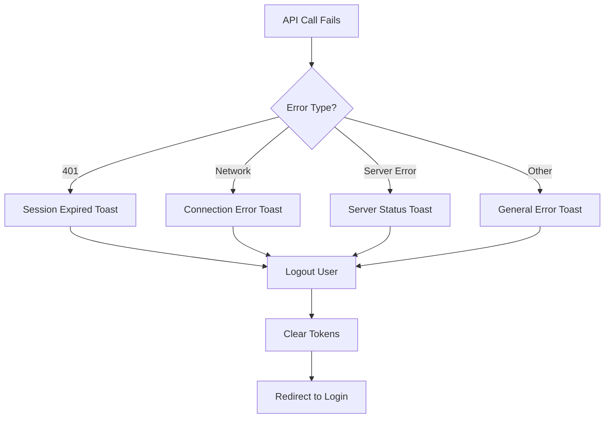

# Authentication Error Handling with Toast Notifications

## Overview

Enhanced the authentication system to provide graceful error handling through the Toast Notification System v2.0, improving user experience when authentication failures occur.

## Implementation Details

### 1. Provider Hierarchy Setup

**Fixed Provider Order** (`src/app/layout.tsx`):
```tsx
<ToastProvider>      // Outer: Provides toast context
  <AuthProvider>     // Inner: Consumes toast context
    {children}
  </AuthProvider>
</ToastProvider>
```

**Critical Fix**: Previously `AuthProvider` was wrapping `ToastProvider`, causing the error "useToast must be used within a ToastProvider". The correct hierarchy allows `AuthProvider` to access toast functionality.

### 2. Error Categorization

**401 Unauthorized Errors**:
- **Message**: "Your session has expired. Please log in again."
- **Trigger**: When refresh token or access token validation fails
- **Action**: Automatic logout after showing notification

**Network Errors**:
- **Message**: "Connection error. Please check your internet and try again."
- **Trigger**: Network connectivity issues, DNS failures
- **Action**: Logout with helpful troubleshooting message

**Server Errors (4xx/5xx)**:
- **Message**: "Unable to connect to server (status). Please try again."
- **Trigger**: Server unavailable, internal server errors
- **Action**: Logout with status code for debugging

**General Errors**:
- **Message**: "An unexpected error occurred. Please try again."
- **Trigger**: Unexpected exceptions, parsing errors
- **Action**: Logout with generic fallback message

### 3. Implementation in useAuth Hook

**Enhanced refreshUser Function**:
```typescript
const refreshUser = async (): Promise<void> => {
  try {
    const currentUser = await authApi.getCurrentUser();
    setUser(currentUser);
  } catch (error) {
    console.error('Failed to refresh user:', error);
    
    // Handle different error types gracefully
    if (error instanceof AxiosError) {
      if (error.response?.status === 401) {
        showErrorToast('Your session has expired. Please log in again.');
      } else if (error.response?.status) {
        showErrorToast(`Unable to connect to server (${error.response.status}). Please try again.`);
      } else {
        showErrorToast('Connection error. Please check your internet and try again.');
      }
    } else {
      showErrorToast('An unexpected error occurred. Please try again.');
    }
    
    await logout();
  }
};
```

## Integration Points

### 1. Authentication Context

**Hook Usage at Component Level**:
```typescript
export const AuthProvider = ({ children }: AuthProviderProps) => {
  const { error: showErrorToast } = useToast(); // Called at component level
  // ... rest of the component
}
```

**Key Benefits**:
- Follows React hooks rules
- Available throughout authentication flow
- Consistent error messaging
- No conditional hook calls

### 2. Error Handling Flow



### 3. User Experience Benefits

**Before Enhancement**:
- Silent logout with no user feedback
- Users confused about sudden redirect to login
- No indication of what went wrong
- Poor debugging experience

**After Enhancement**:
- Clear error messages explaining what happened
- Toast notifications provide immediate feedback
- Different messages for different error types
- Users understand why they need to log in again
- Better debugging information in development

## Toast System Integration

### 1. Toast Configuration

**Error Toast Properties**:
- **Type**: Error (red border, error icon)
- **Duration**: 5000ms (5 seconds)
- **Position**: Top-right
- **Dismissible**: Yes
- **Queue**: Maximum 3 toasts, prevents duplicates

### 2. Message Design

**Message Structure**:
- **Single Line**: Combined title and message for clarity
- **User-Friendly**: Plain language, no technical jargon
- **Actionable**: Clear next steps (log in again)
- **Helpful**: Specific guidance for network issues

### 3. Accessibility

**ARIA Support**:
- Live regions for screen readers
- Proper role attributes
- Keyboard navigation
- Focus management

## Testing Scenarios

### 1. Session Expiration

**Scenario**: Access token expires during user activity
**Expected**: Toast shows "Your session has expired. Please log in again."
**Result**: User redirected to login with clear understanding

### 2. Network Disconnection

**Scenario**: User loses internet connection
**Expected**: Toast shows "Connection error. Please check your internet and try again."
**Result**: User knows to check connectivity

### 3. Server Downtime

**Scenario**: Backend server returns 500 error
**Expected**: Toast shows "Unable to connect to server (500). Please try again."
**Result**: User knows it's a server issue, not their fault

### 4. Token Corruption

**Scenario**: Malformed token in storage
**Expected**: Toast shows "An unexpected error occurred. Please try again."
**Result**: User gets helpful fallback message

## Security Considerations

### 1. Information Disclosure

**Safe Error Messages**:
- No sensitive information in user-facing messages
- Generic messages for security-related failures
- Detailed logging in console for developers

### 2. Rate Limiting

**Toast Deduplication**:
- Prevents spam from repeated auth failures
- Maximum 3 toasts in queue
- Duplicate prevention for similar messages

### 3. Token Cleanup

**Secure Logout Process**:
- Clear all storage types (localStorage, cookies)
- Remove authorization headers
- Reset authentication state
- Call backend logout endpoint

## Development Tools

### 1. Debug Information

**Development Mode Features**:
- Console logging of error details
- Token expiration countdown
- Storage method indicators
- Refresh token status

### 2. Error Simulation

**Testing Commands** (Development):
```javascript
// Simulate 401 error
authApi.getCurrentUser = () => Promise.reject(new AxiosError('Unauthorized', '401', {}, {}, { status: 401 }));

// Simulate network error
authApi.getCurrentUser = () => Promise.reject(new AxiosError('Network Error'));

// Test token expiration
enhancedTokenManager.clearTokens();
```

## Future Enhancements

### 1. Retry Mechanisms

**Planned Features**:
- Automatic retry for network errors
- Exponential backoff for server errors
- User-initiated retry buttons in toasts

### 2. Enhanced Messaging

**Advanced Error Handling**:
- Maintenance mode notifications
- Specific error codes from backend
- Contextual help links
- Multi-language support

### 3. Analytics Integration

**Error Tracking**:
- Authentication failure rates
- Error type distribution
- User recovery patterns
- Performance impact metrics

This implementation provides a robust, user-friendly authentication error handling system that improves the overall user experience while maintaining security and providing helpful feedback for different failure scenarios.
